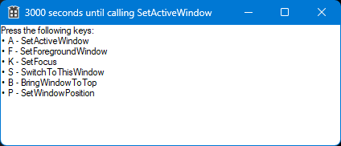

# SetForegroundActiveFocusWindow

Tests various focus setting functions in Windows to see which ones annoyingly steal
the keyboard focus from the active window.

- SetActiveWindow
- SetFocus
- SetWindowPosition
- BringWindowToTop
- SetForegroundWindow
- SwitchToThisWindow

## Results:

- ✅ *SetActiveWindow* - Okay. Does not steal keyboard focus away from another process.
- ✅ *SetFocus* - Okay. Does not steal keyboard focus away from another process.
- ✅ *SetWindowPosition* - Okay. Changes the window z-layer but does not steal focus.
- ❔ *BringWindowToTop* - Huh. Does not seem to do anything?
- ❌ *SetForegroundWindow* - Evil function - do not call.
- ❌ *SwitchToThisWindow* - Evil function - do not call.
